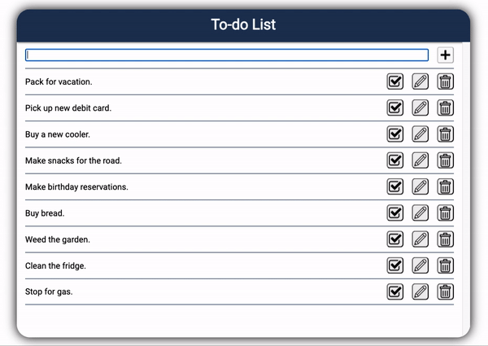
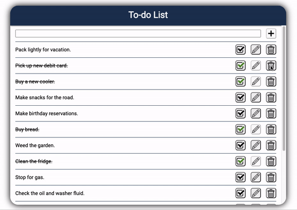

# TodoList

#### Description:
A basic to-do list web application that allows users to add, complete, edit, and/or delete items of their choosing.
* Vanilla JS
* CSS
* HTML

#### Adding an item:
Users can add an infinite amount of items by using the main input field.

#### Checking off an item:
Users can check off any specified item by clicking the black checkmark to turn it green.

#### Editing an item:
Users can edit any item's name and save changes.

#### Deleting an item:
Users can permanently wipe an item from the list by clicking the trash button.

#### Miscellaneous (scrolling)
To allow for more than 10 items, the to-do list will create a scrollbar to prevent data loss.

